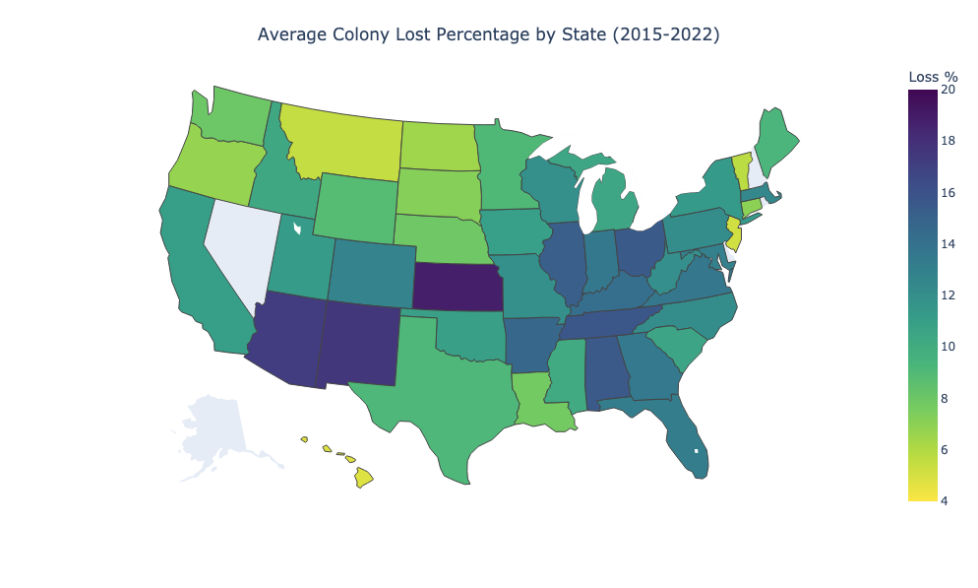
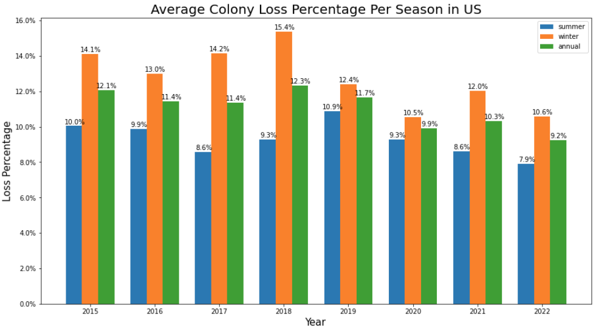
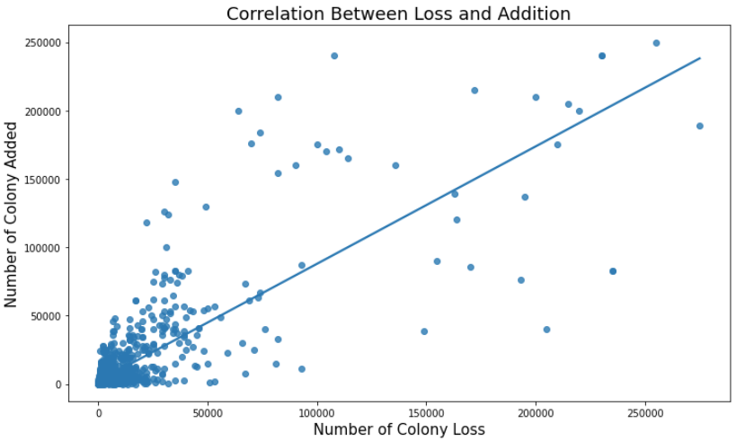
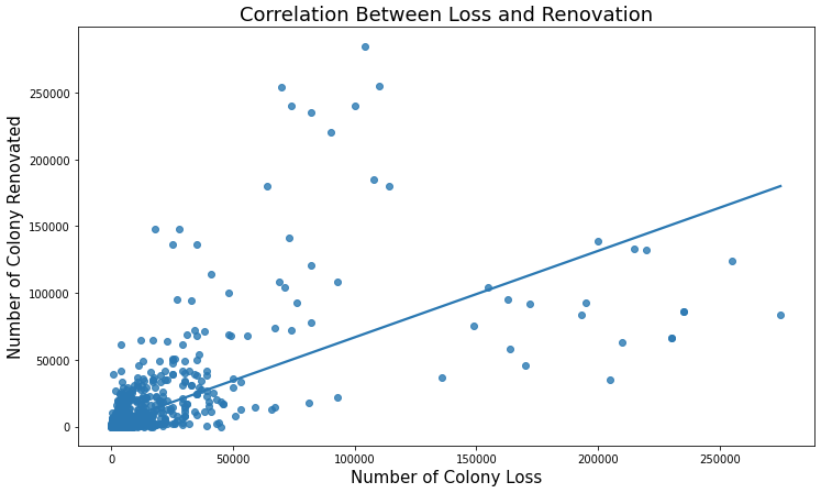

# Bee Colony Loss Analysis

## Introduction

> This report provides information on honey bee colonies in terms of number of colonies, maximum, lost, percent lost, added, renovated, and percent renovated, as well as colonies lost with Colony Collapse Disorder symptoms with both over and less than five colonies. The report also identifies colony health stressors with five or more colonies. The data for operations with honey bee colonies are collected from a stratified sample of operations that responded as having honey bees on the Bee and Honey Inquiry and from the NASS list frame. For operations with five or more colonies, data was collected on a quarterly basis; operations with less than five colonies were collected with an annual survey.

Honey bee is one of the most important crop pollinators in the United States. It is estimated that the honey bees add $15 billion worth of crop each year. Over the past 50 years, however, the percentage of honey bee colonies have declines dramatically with 30 percent of bee hives collapsed due to pesticide, parasite, diseases, and malnutrition. In this analysis, I conducted a basic analysis on the trend of the US honey bee colonies loss percentage since the year of 2015 with stressors including varroa mites, pesticides, and diseases.

## Analysis

The percentage of colonies loss varies across the states. Kansas has the highest average percentage of loss (18.85%). New Mexico and Arizona follow with the loss rate of 17.59% and 17.21%, respectively. Hawaii and New Jersey have the lowest average loss percentage of 5.15% and 4.75%.

The average annual colony lost percentage has been declining since 2015 from 12.1% to 9.2%. The loss percentage dramatically increases during the winter and the caused of this rise is due to [various factors](https://www.beepods.com/top-5-reasons-bees-dont-survive-winter/#:~:text=The%20warm%20moisture%20evaporates%20off,results%20in%20the%20bees%20dying.).

## Data Resource / References

- [Honey Bee Colonies Data Set](https://usda.library.cornell.edu/concern/publications/rn301137d?locale=en)
- [Conservation Work for Honey Bees](https://www.nrcs.usda.gov/wps/portal/nrcs/detail/national/plantsanimals/pollinate/?cid=stelprdb1263263)
- [UNITED STATES HONEY BEE COLONY LOSSES 2020-2021: PRELIMINARY RESULTS](https://beeinformed.org/2021/06/21/united-states-honey-bee-colony-losses-2020-2021-preliminary-results/)
