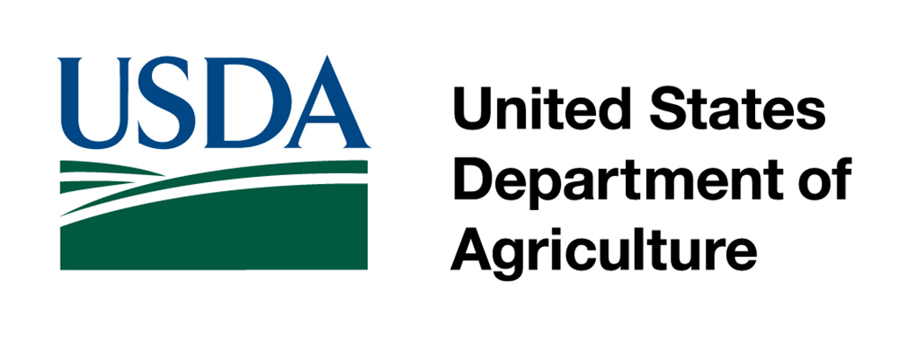
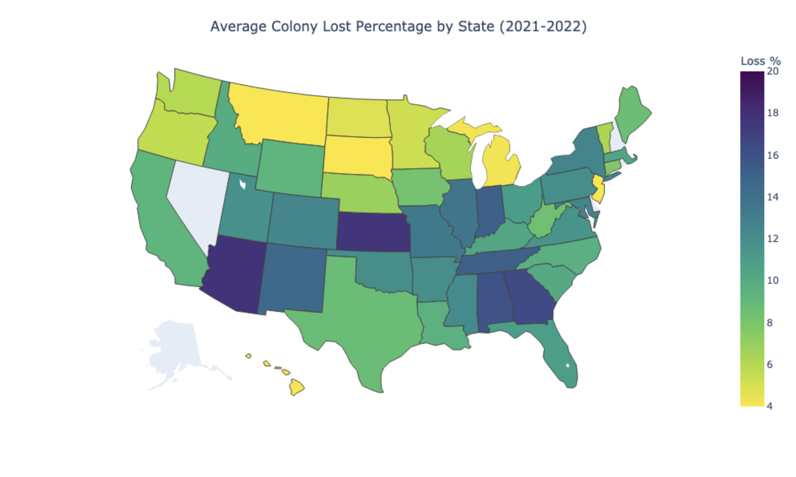
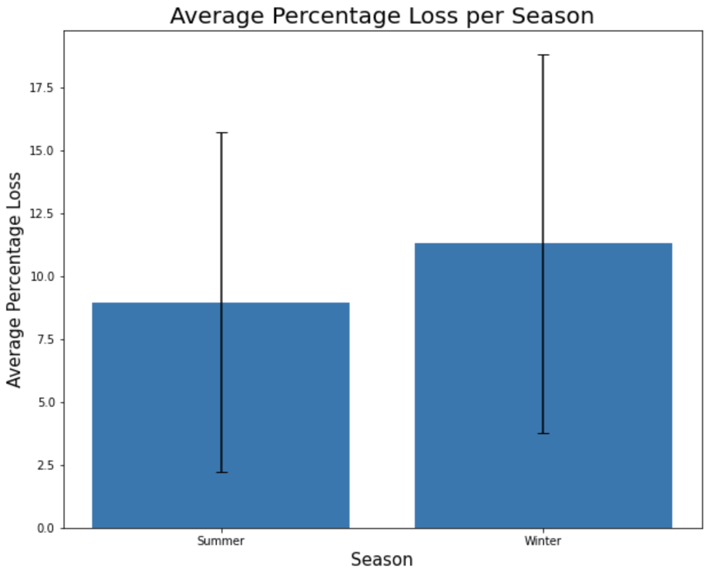
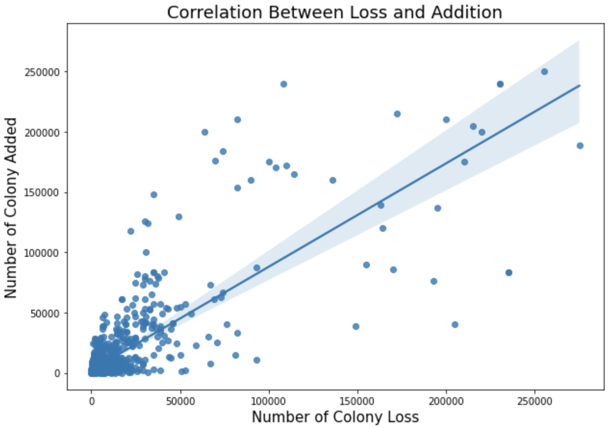
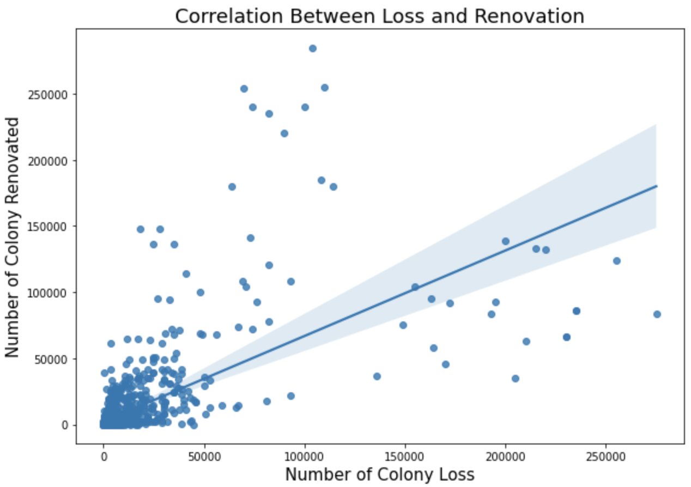
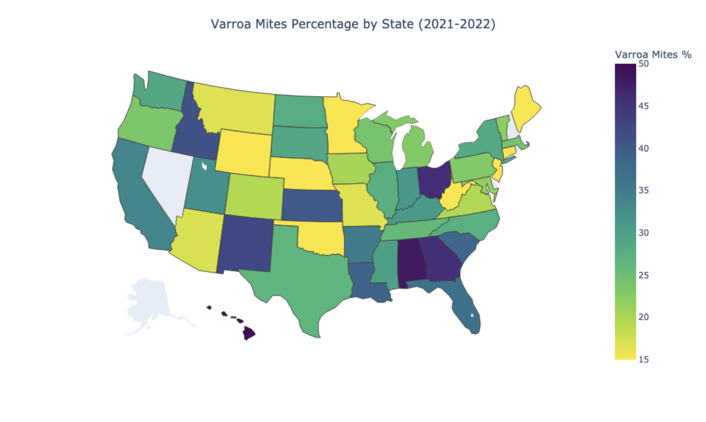
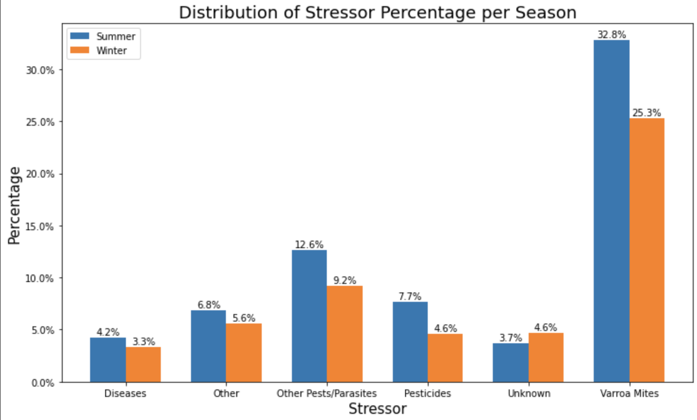
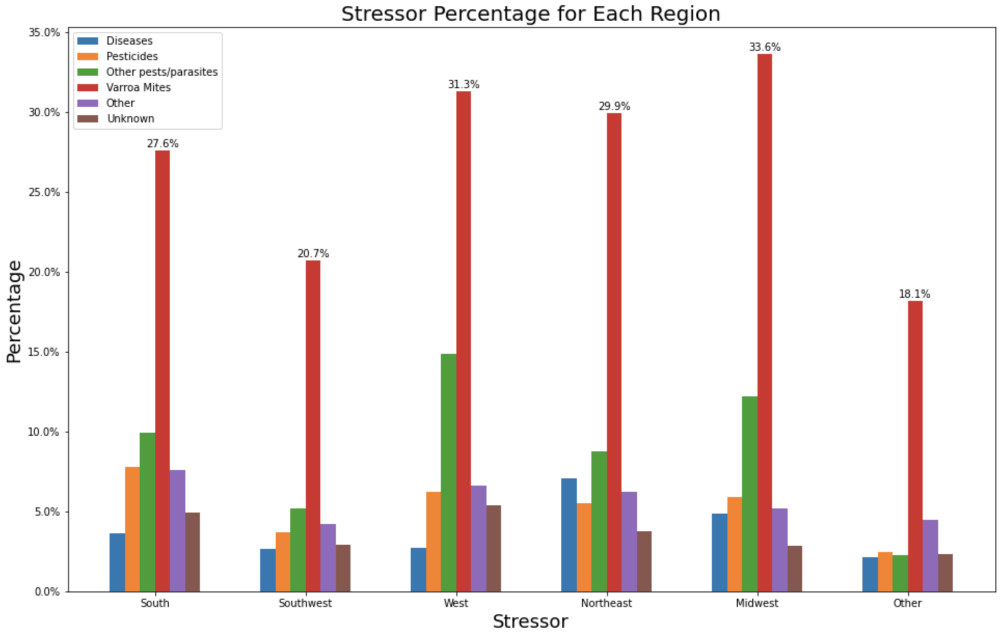

# Bee Colony Loss Analysis

> This report provides information on honey bee colonies in terms of the number of colonies, maximum, lost, percent lost, added, renovated, and percent renovated, as well as colonies lost with Colony Collapse Disorder symptoms with both over and less than five colonies. The report also identifies colony health stressors with five or more colonies. The data for operations with honey bee colonies are collected from a stratified sample of operations that responded as having honey bees on the Bee and Honey Inquiry and from the NASS list frame. For operations with five or more colonies, data was collected on a quarterly basis; operations with less than five colonies were collected with an annual survey.

## Motivation

The honey bee is one of the most important crop pollinators in the United States. It is estimated that the honey bees add $15 billion worth of crops each year. Over the past 50 years, however, the percentage of honey bee colonies have declined dramatically with 30 percent of bee hives collapsing due to pesticide, parasite, diseases, and malnutrition. In this report, I conducted a basic analysis of the trend of the US honey bee colonies loss from 2021 to 2022 with stressors including varroa mites, pesticides, and diseases and compare the result with that of before 2021.

## Project Goals

1. US honey bee colonies loss trend from 2021 to 2022.
2. Colony loss analysis per season.
3. Amount of impact for each stressor from Varroa Mites to pesticides.

## Data Import

On the [United States Department of Agriculture data library](https://usda.library.cornell.edu/concern/publications/rn301137d?locale=en), all relevant datasets are posted (May 2016 - Aug 2022) as zipped files. Automated data importing procedure using Python libraries such as request, beautifulsoup, etc. Each year dataset is automatically imported into the newly created directory appropriately, then unzipped. 

## Data Cleaning

Each dataset is preprocessed while importing. Through procedure can be found [here](./preprocess.ipynb).

## Analysis

The beekeepers who participated in the survey reported that the overall average colony loss percentage in the US is 10.1% [95% CI 9.36–10.77%] from January 2021 to June 2022 while that of before 2021 is 11.23% [95% CI 10.88-11.58%]. The colony loss percentage varies across the states. In 2021-2022, Arizona has the highest average percentage loss of 17.88% [95% CI 12.64-23.11%] followed by Kansas and Georgia with a loss rate of 17.75% [95% CI 12.72-22.78%] and 16.5% [95% CI 14.66-18.34%], respectively. Hawaii and New Jersey have the lowest average loss percentage of 3.75% [95% CI 1.87-5.63%]and 2.38% [95% CI 1.61-3.14%].

 

The average annual loss percentage in 2021-2022 is 9.79% [95% CI 8.22-11.35%]. Before 2021, the average percentage was estimated at 11.04% [95% CI 10.24-11.85%]. The average annual colony lost percentage has slightly declined (by 1.25%). In 2021-2022, the loss percentage of the summer and that of winter are  8.96% [95% CI 8.15-9.77%] and 11.29% [95% CI 10.39-12.19%], respectively. This difference between the two seasons is due to [various factors](https://www.beepods.com/top-5-reasons-bees-dont-survive-winter/#:~:text=The%20warm%20moisture%20evaporates%20off,results%20in%20the%20bees%20dying.).

Despite the continuing high colony loss rates, the overall number of colonies has increased to 2.59 million in 2016 from 2.39 million in 2006, for example. One explanation for this increase is the beekeepers' efforts to manage the colonies: splitting healthy colonies to replace dead colonies or adding more colonies. In the year 2021-2022, the correlations between the colony loss - colony added and colony loss - colony renovated are almost identical with 0.779 [95% CI ]and 0.772, respectively. There is not a particular preference among beekeepers regarding whether to add or renovate bee colonies.

 

Among the stressors, varroa mites had the largest damage with 27.33% [95% CI 25.58-29.09%] between 2021-2022. Interestingly, Hawaii, the state with the lowest average colony loss percentage, has the highest damage caused by varroa mites with 65.35% [95% CI 58.23-72.47%] while Wyoming has the lowest percentage with 7.85% [95% CI 4.85-10.87%]. Arizona has 16.98% [95% CI 10.45-23.5%] and Kansas has 40.2% [95% CI 30.05-50.35%]

The distributions of stressors (Varroa Mites, pesticites, diseases, others, and unknown) are as follows. Regardless of the weather or region, varroa mites have the highest percentages, followed by other pesticides/parasites. 

## References

- [Honey Bee Colonies Data Set](https://usda.library.cornell.edu/concern/publications/rn301137d?locale=en)
- [Conservation Work for Honey Bees](https://www.nrcs.usda.gov/wps/portal/nrcs/detail/national/plantsanimals/pollinate/?cid=stelprdb1263263)
- [UNITED STATES HONEY BEE COLONY LOSSES 2020-2021: PRELIMINARY RESULTS](https://beeinformed.org/2021/06/21/united-states-honey-bee-colony-losses-2020-2021-preliminary-results/)
- [A national survey of managed honey bee 2015–2016 annual colony losses in the USA](https://www.tandfonline.com/doi/full/10.1080/00218839.2017.1344496)
